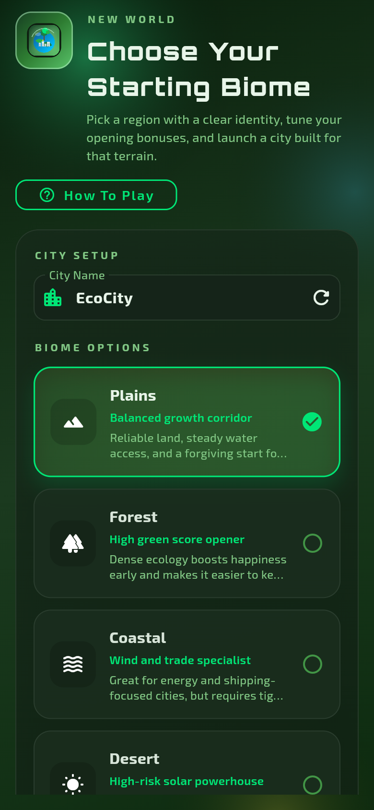

# EcoEmpire

A strategy simulation game focused on building sustainable empires, built with Flutter and deployed as a web application.

## 🎮 Play the Game

Visit the live website: [https://innnervision.github.io/EcoEmpire/](https://innnervision.github.io/EcoEmpire/)

## 📸 Screenshots

### Splash Screen

### World Selection

### City View

### How to Play

### Settings

## 🚀 Features

- City building simulation
- Resource management
- Environmental sustainability themes
- Multiple worlds to explore
- Strategic gameplay

## 🛠️ Tech Stack

- Flutter
- Dart
- Firebase (for backend services)

## 📝 License

This project is open source and available under the MIT License.
